# 💼 ZenithZone

## 📑 Índice
1. [Descripción del Proyecto](#descripción-del-proyecto)
2. [Tecnologías Utilizadas](#tecnologías-utilizadas)
   - 2.1 [Backend](#backend)
   - 2.2 [Frontend](#frontend)
3. [ Vistas de la Aplicación](#vistas-de-la-aplicación)
   - 3.1 [Home](#home)
   - 3.2 [Instalaciones](#instalaciones)
   - 3.3 [Servicios](#servicios)
   - 3.4 [Details](#details)
   - 3.5 [Entrenadores](#entrenadores)
   - 3.6 [Register y Login](#register-y-login)
   - 3.7 [Profile del Usuario](#profile-del-usuario)
   - 3.8 [Dashboard de Entrenador](#dashboard-de-entrenador)
   - 3.9 [Dashboard de Administrador](#dashboard-de-administrador)
4. [Como Ejecutar el Proyecto](#como-ejecutar-el-proyecto)


## Descripción del Proyecto
Este proyecto es una plataforma que representa un centro de alto rendimiento diseñada para conectar a **deportistas**, **entrenadores** y **administradores**, optimizando el proceso de inscripción a entrenamientos y la gestión de pistas de manera sencilla y efectiva.


### Funcionalidades:

- **Usuario Deportista (Clientes)**: 
  - Inscribirse a entrenamieno.
  - Reservar una pista.
  - Ver sus inscripciones.
  - Ver sus reservas de pistas.
  - Ver sus gráficas de rendimiento.

- **Entrenadores**: 
  - Ver sus entrenamientos.
  - Ver los alumnos de los entrenamientos.
  - Hacer gráficas de rendimiento.
  - Crear entrenamientos.
  - Eliminar sus entrenamientos.

- **Administradores**:
  - Crear/Editar/Eliminar pistas y deportes.
  - Registrar/Eliminar entrenadores.
  - Aceptar/Denegar entrenmaientos.
  - Crear/Eliminar salas privadas entrenador.
  - Crear/Eliminar pistas privadas.
  - Ver y eliminar reservas.

El sistema facilita la conexión entre los deportistas y los entrenadores, permitiendo la inscripción a entrenamientos y el uso de las instalaciones deportivas de forma **intuitiva**.

## Tecnologías Utilizadas
Este proyecto utiliza una variedad de tecnologías modernas para asegurar su rendimiento, seguridad y escalabilidad.

<p align="center">
  <a href="https://skillicons.dev">
    
  </a>
  <a href="https://jwt.io" rel="nofollow">
    
  </a>&nbsp;&nbsp;&nbsp;&nbsp;&nbsp;&nbsp;
  <a href="https://skillicons.dev">
    
  </a>&nbsp;&nbsp;&nbsp;&nbsp;&nbsp;&nbsp;
  <a href="https://skillicons.dev">
    
  </a>
</p>

### Backend

- **Spring Boot**: Framework basado en Java que simplifica la creación de aplicaciones empresariales robustas, escalables y listas para producción.
- **Spring Data JPA**: Subproyecto de Spring que facilita la interacción con bases de datos relacionales mediante JPA (Java Persistence API). Proporciona abstracciones de alto nivel para trabajar con repositorios y simplifica la implementación de consultas.
- **Hibernate**: ORM para Java que simplifica la interacción con bases de datos relacionales, utilizado frecuentemente con Spring Boot y complementado por Spring Data JPA.
- **Laravel**: Framework PHP que facilita la creación de aplicaciones web con un enfoque en una sintaxis elegante y un conjunto robusto de herramientas integradas.
- **Eloquent**: ORM integrado en Laravel que facilita la interacción con bases de datos relacionales de forma fluida y expresiva.
- **MySQL**: Sistema de gestión de bases de datos relacional ampliamente utilizado, ideal para almacenar datos estructurados.
- **JWT (JSON Web Tokens)**: Utilizado para la autenticación y autorización mediante tokens de sesión, lo que facilita el manejo de usuarios y sus permisos.
- **Argon2**: Algoritmo de hashing de contraseñas utilizado para almacenar las contraseñas de los usuarios de manera segura.
- **Bcrypt**: Algoritmo de hashing de contraseñas diseñado para almacenar contraseñas de manera segura, proporcionando una mayor resistencia frente a ataques de fuerza bruta.
- **Relaciones Polimorficas**: Permiten que un modelo esté relacionado con múltiples otros modelos mediante una única relación. En este proyecto se realizan en Laravel y en Springboot.
- **Migraciones**: Todas las migraciones para la creación y mantenimiento del esquema de la base de datos se realizan desde Laravel. Esto permite una gestión centralizada y coherente del modelo de datos, asegurando compatibilidad con las implementaciones en ambos frameworks.

### Frontend

- **Vue.js**: Framework progresivo de JavaScript para construir interfaces de usuario interactivas y aplicaciones web dinámicas de una sola página (SPA).
- **JavaScript**: Lenguaje de programación del lado del cliente utilizado para agregar interactividad a las páginas web.
- **HTML**: Lenguaje de marcado para estructurar contenido web.
- **CSS**: Lenguaje de estilos utilizado para diseñar la apariencia de las páginas web.

## Vistas de la Aplicación
Aquí se muestran las principales vistas de la aplicación junto con una descripción de lo que cada sección ofrece al usuario.

### Home
---
El home como primera pagina, muestra el Logo de la empresa/polideportivo, y al final una lista de algunos de los deportes.

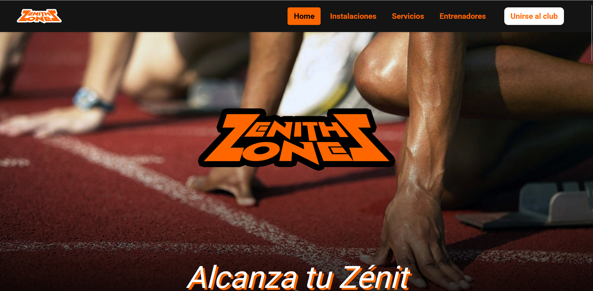

Al final se muestra un ejemplo de la grafica, y una lista de 8 de los principales deportes, haciendo el salto en los deportes a las pistas.

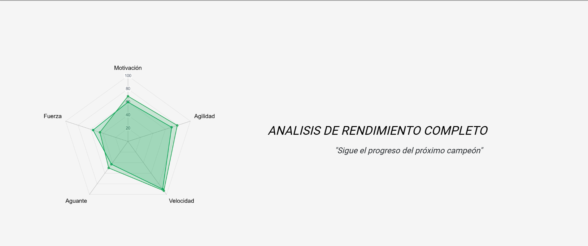

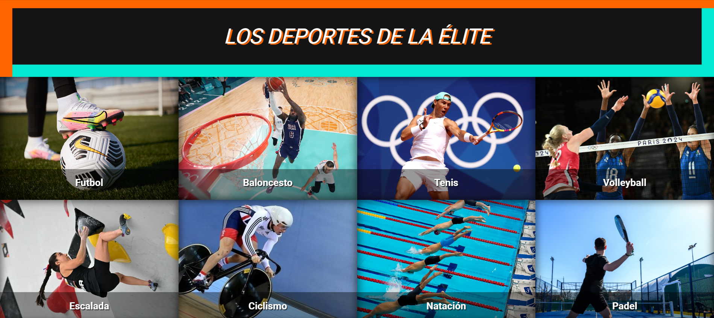

### Instalaciones
---

Aqui se muestras todas las pistas que tiene el polidportivo, y al hacer click en una de ellas, nos lleva a una segunda pagina, que nos permite reservar estas, par aun dia y un horario (mañana, mediodia, tarde o noche).

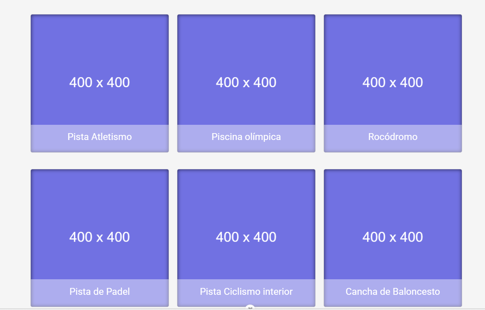

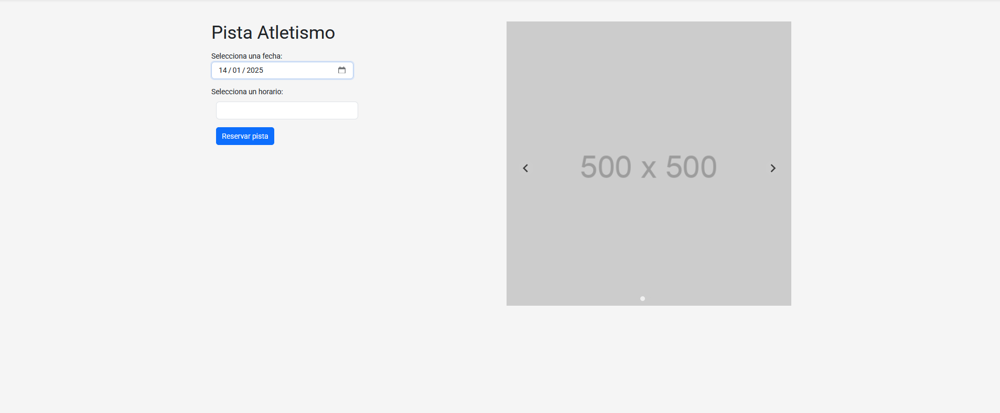


### Servicios
---

Aqui podemos ver una lista de los deportes, una muestra de como funcionan las gráficas, y principalmente, la opcion de buscar y apuntarse a Entrenamientos, filtrados, segun dia, precio, deporte o duracion

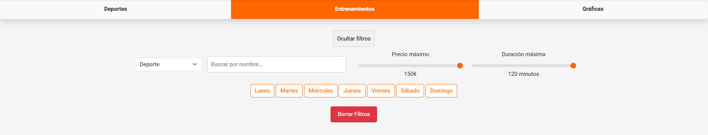


### Details
---
Aqui mostramos los detalles del Entrenamiento al completo.


### Entrenadores
---
Esta sección muestra el personal,  los entrenadores a cargo de los entrenamientos y su email de contacto.

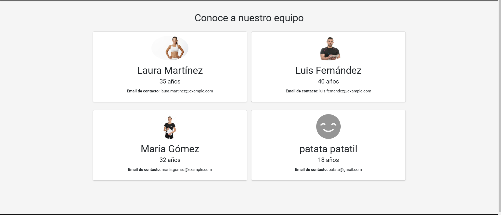


### Register y Login
---
Esta sección nos permite hacer un login de usuario o registrarnos,  tanto Entrenadores como Aministradores usan el mismo login, aunque estos dos no se registran, y el register es solo para los usuarios comunes.

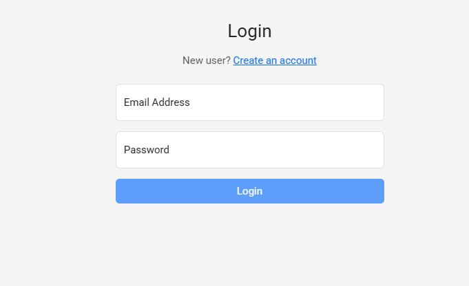

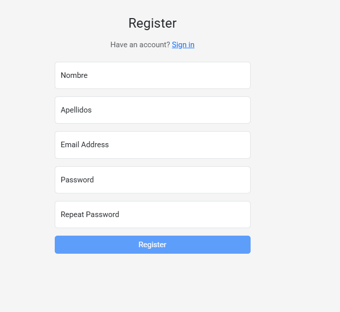


### Profile del Usuario
---
El profile de usuario muestra, los entrenamientos a los que esta apuntado, las pistas que tiene reservadas de forma historica,  ordenadas por pistas, uniucamente pudiendo cancelar reservas de pistas de dias posteriores a la fecha actual, tambien es el lugar donde el usuario puede ver sus graficas.

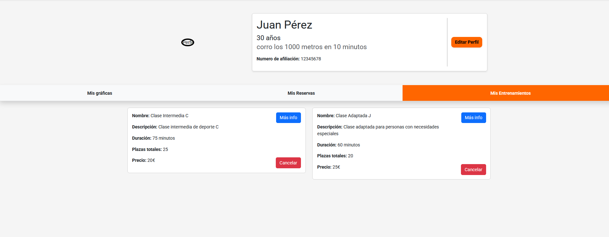
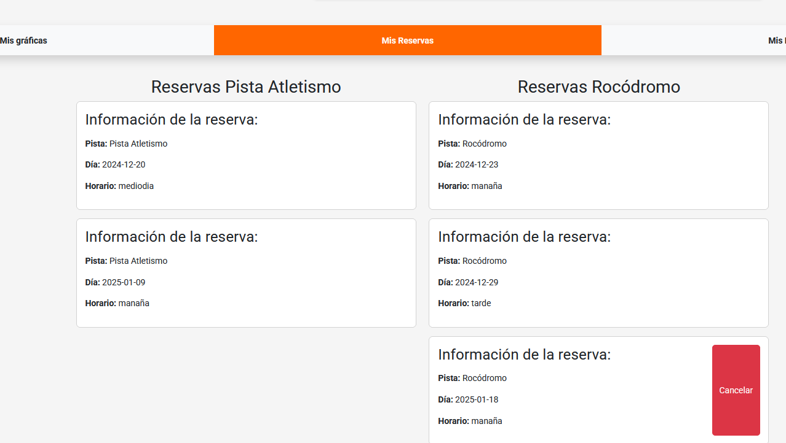
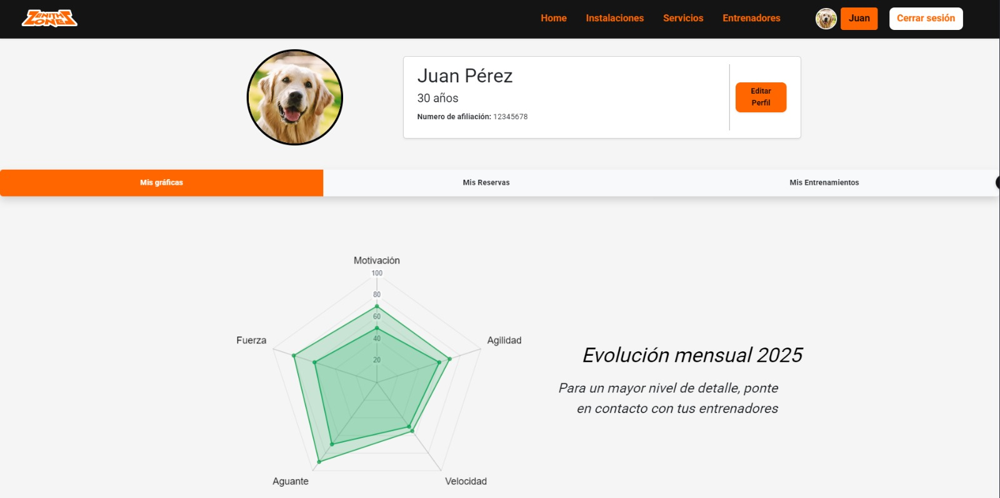


### Dashboard de Entrenador
---

El dashboard de Entrenadores es una sección exclusiva de los entrenadores que les permitan ver sus entrenamientos, crear entrenamientos nuevos, o dentro de los entrenamientos verlos usuarios apuntados, y modificar las graficas de dichos usuarios


### Dashboard de Administrador
---

El deashboard Admin es una sección exclusiva del Administrador con numerosas funciones, entre ellas

Ver deportes y pistas

Crearlos y editarlos

Ver los entrenadores y borrarlos

crear entrenadores

ver los entrenamientos y denegarlos o aceptarlos

crear las salas privadas

crear y eliminar las pistas privadas

Eliminar Reservas y ver un historial de estas


## Como Ejecutar el Proyecto

Para ejecutar el proyecto, sigue este paso:

### Para ejecutar el proyecto entero la primera vez, entra a Docker Compose y ejecuta:

```bash
cd ./carpeta_proyecto
docker-compose up -d --build
```

### Para ejecutar el proyecto entero las siguientes veces, entra a Docker Compose y ejecuta:

```bash
cd ./carpeta_proyecto
docker-compose up -d
```


